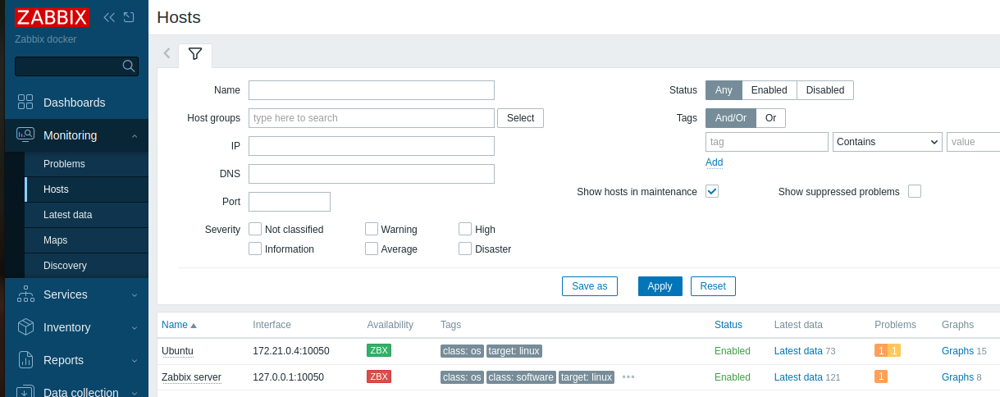
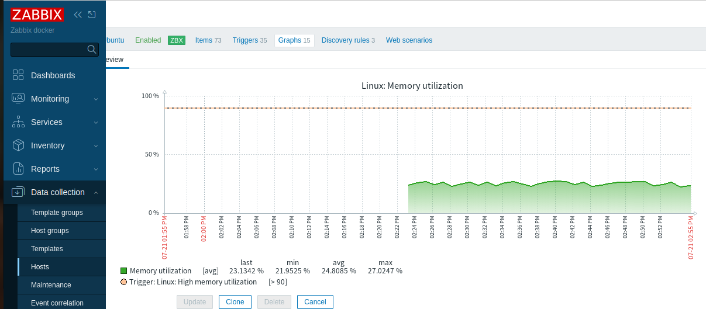
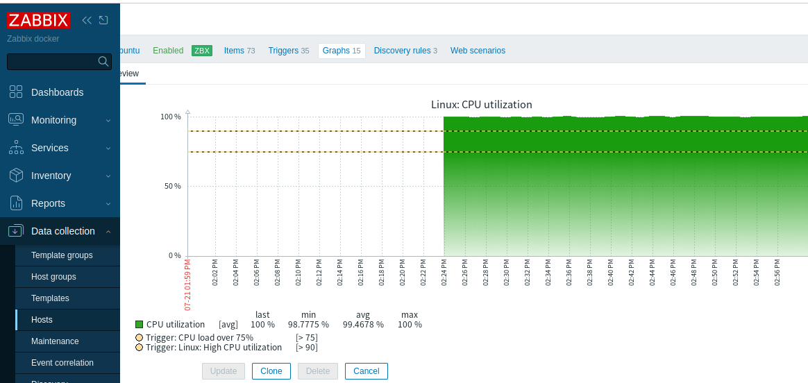

# zabbix-lab
Zabbix monitoring lab deployed in Docker on Ubuntu.

## Architecture

- **Zabbix Server** — collects data from agents (port 10051)
- **Zabbix Web** — Nginx frontend (port 8080)
- **MySQL** — database for metrics
- **Zabbix Agent** — monitored host

## Quick Start

```bash
docker-compose up -d

Open: http://localhost:8080
    Login: Admin
    Password: zabbix

Monitoring Setup
    Host: Ubuntu
    Template: Linux by Zabbix agent
    Items: 73 (CPU, Memory, Disk, Network)
    Triggers: 35
    Custom trigger: CPU load over 75%

Screenshots
| Dashboard                         | Description                   |
| --------------------------------- | ----------------------------- |
|    | Host availability (ZBX green) |
|        | CPU utilization with triggers |
|  | Memory utilization ~23%       |

Tech Stack
    Zabbix 7.0
    Docker & Docker Compose
    MySQL 8.0
    Ubuntu
